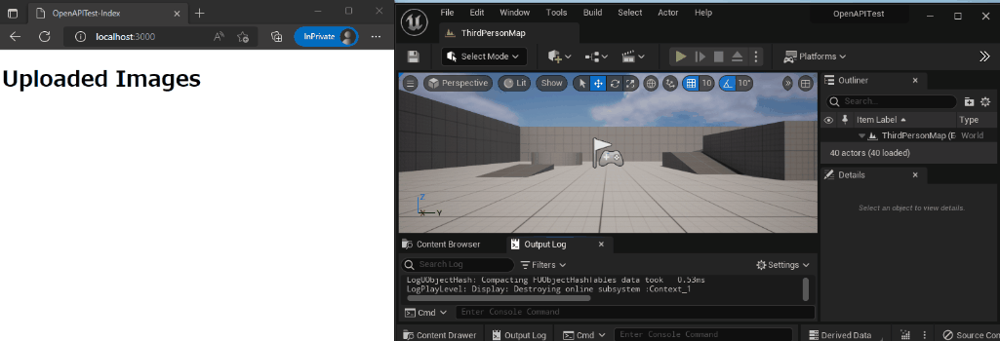

# openapi_test_ue
Example of node js server and Unreal Engine client using OpenAPI.

Sever feature
- Receive screenshot upload request from UnrealEngineClient.
- Screenshot web viewer.

UnrealEngine client feature
- Take UnrealEngine screenshot and send upload request to server.

## Using Example server
Example server is run with docker.  

**Server control commands**

|Command|Summary|
|:-|:-|
|`make run-example-server`| Run example server on localhost:3000.|
|`make stop-example-server`| Stop example server.|
|`make backup-example-server BACKUP_FILE=backupfilename.tar`|Backup example server.Backup file is stored at `exampleserver/backup`|
|`make restore-example-server BACKUP_FILE=backupfilename.tar`|Restore example server from specified backup file.After this command, server is stopped.|
|`make clean-example-server`|Stop example server and remove docker containers/network/volume/image created by `make run-example-server`.|

## Using UnrealEngine client
Build and launch example project at `ue/OpenAPITest/OpenAPITest.uproject`.  
After playin, type console command `upload` to take screenshot and upload to example server.  
If complete command with no error, uploaded screenshot is listed on example server index page.

## Generate UnrealEngine client code from OpenAPI file
`make gen-api` to generate code.  
Generated codes are stored at `ue/OpenAPITest/Plugins/Service/Source/OpenAPI`.

## Edit OpenAPI file with swagger editor
`make run-swagger-editor` to run swagger editor on localhost:8080.  
`make stop-swagger-editor` to stop swagger editor and remove docker container.
